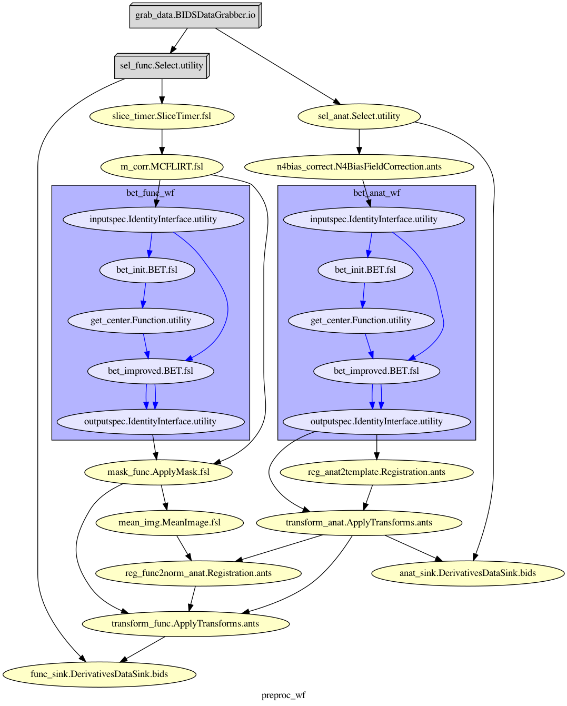

# fMRI-rep: Reproducing an fMRI analysis with open-source software tools.

The objective of this project is to develop and showcase a complete fMRI workflow that implements open-source software tools. 
The results of this project will be (1) a set of "tutorial notebooks" that provide detail of the tools implemented in each stage of the workflow, and
(2) a set of deployable toy workflows and a manual with instruction for automated reproduction of the current analysis. 
As such, this project will provide a barebones tutorial for learning open-source neuroimaging software with a reproducible data science focus. 

## [1. Visualizing raw data with Nilearn's plotting module](https://github.com/vgonzenbach/fmri-rep/blob/master/data/viz/viz-subject.ipynb)

### T1w

### EPI

### Design matrix

## [2. Developing a re-usable preprocessing pipeline with Nipype](https://github.com/vgonzenbach/fmri-rep/blob/master/preproc/preproc-subject.ipynb)

### Workflow graph

The data used in this project corresponds to the article, Neural Processing of Emotional Musical and Nonmusical Stimuli in Depression, and is available at [OpenNeuro.org](https://openneuro.org/datasets/ds000171/versions/00001)
